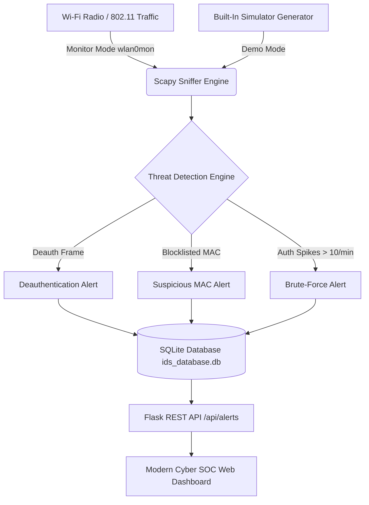

# 🛡️ Wi-Fi Intrusion Detection & Investigation System (Wi-Fi IDS)

[](https://www.python.org/)
[](https://flask.palletsprojects.com/)
[](https://scapy.net/)
[](LICENSE)
[](https://wifi-ids.onrender.com)

A modern, full-stack cybersecurity web application that performs **real-time 802.11 Wi-Fi frame inspection**, detects wireless attack signatures, logs forensic evidence into an **SQLite** database, and provides an interactive, terminal-styled **dark SOC dashboard**.

---

## 🌟 Key Highlights

- âš¡ **Zero-Hardware Simulation Mode (Default):** Runs anywhere (Windows, macOS, Linux, and Cloud Web Hosts like Render, Railway, Vercel) without needing a specialized wireless adapter in monitor mode.
- 📡 **Real-Time Packet Inspection:** Built with **Scapy** to sniff raw 802.11 frames on monitor-mode interfaces (`wlan0mon`).
- 🚨 **Multi-Vector Attack Detection Engine:**
  - **Deauthentication Floods (`Dot11Deauth`):** Detects DoS / disconnect attacks that force clients off the network.
  - **Rogue / Suspicious MAC Addresses:** Automatically identifies blocklisted / spoofed MAC prefixes.
  - **Brute-Force Authentication Floods:** Tracks authentication frame spikes across a sliding time window.
- 📊 **Cyberpunk / SOC Web Interface:**
  - Live animated radar scanner and CRT scanline aesthetic.
  - Real-time auto-polling threat feed with color-coded severity badges.
  - Stat counters for Total Alerts, Deauth Attacks, Rogue MACs, and Auth Floods.
- 🔎 **Forensic Log Investigation:**
  - Searchable & filterable historical log viewer.
  - 💾 **One-Click CSV Export** for forensic reporting and incident documentation.
  - Instant database wipe/reset capabilities.

---

## 🏗️ System Architecture



---

## 📁 Repository Structure

```
WiFi-IDS/
├── app.py                 # Core Flask application, Scapy sniffer & SQLite models
├── requirements.txt       # Dependencies (Flask, Scapy, Gunicorn)
├── Procfile               # Production WSGI process definition for cloud hosts
├── render.yaml            # 1-Click Render blueprint configuration
├── vercel.json            # Vercel serverless deployment definition
├── .gitignore             # Git ignore file for DBs, virtual environments, caches
├── README.md              # Project documentation
├── templates/             # Jinja2 HTML Templates
│   ├── base.html          # Shared layout & navigation bar
│   ├── home.html          # Cyber-styled landing page & animated radar
│   ├── dashboard.html     # Real-time monitoring & alert telemetry dashboard
│   └── logs.html          # Forensic investigation & CSV export console
└── static/                # Frontend assets
    ├── style.css          # Cyberpunk dark theme styling & animations
    └── main.js            # Live dashboard polling & dynamic DOM updates
```

---

## 🚀 Live Cloud Deployment

You can host this project online for free in under 2 minutes:

### Option 1: Deploy on Render (Recommended)

1. Fork or push this repository to your GitHub account: `sahuom890/WiFi-IDS`.
2. Go to [Render Dashboard](https://dashboard.render.com/) and click **New +** → **Web Service**.
3. Connect your **WiFi-IDS** repository.
4. Render will auto-detect the configuration, or enter:
   - **Environment:** `Python 3`
   - **Build Command:** `pip install -r requirements.txt`
   - **Start Command:** `gunicorn app:app`
5. Click **Create Web Service**. Your live dashboard will be accessible globally via HTTPS!

---

## 💻 Local Setup & Installation

### Prerequisites

- **Python 3.9+** ([Download Python](https://www.python.org/downloads/))
- **Git**

### 1. Clone the Repository

```bash
git clone https://github.com/sahuom890/WiFi-IDS.git
cd WiFi-IDS
```

### 2. Create and Activate Virtual Environment

```bash
# Windows (PowerShell)
python -m venv venv
.env\Scripts\Activate

# macOS / Linux
python3 -m venv venv
source venv/bin/activate
```

### 3. Install Dependencies

```bash
pip install -r requirements.txt
```

### 4. Run the Application

```bash
python app.py
```

Open your browser and navigate to: **`http://127.0.0.1:5000`**

---

## 🕹️ Dashboard Preview & Pages

| Page | URL | Description |
|---|---|---|
| 🏠 **Home** | `/` | System overview, core capabilities, animated radar |
| 📊 **Dashboard** | `/dashboard` | Live packet analysis feed, Start/Stop toggle, realtime stats |
| 📜 **Forensic Logs** | `/logs` | Complete alert history, search, filtering, CSV export |

---

## 📡 REST API Documentation

| Method | Endpoint | Description |
|---|---|---|
| `GET` | `/api/status` | Get current monitoring status (`running`, `simulation`) |
| `POST` | `/api/start` | Start the intrusion detection capture loop |
| `POST` | `/api/stop` | Stop the intrusion detection capture loop |
| `GET` | `/api/alerts` | Fetch latest 50 alerts (JSON) |
| `GET` | `/api/alerts/all` | Fetch all historical alerts (JSON) |
| `POST` | `/api/alerts/clear` | Clear/truncate the SQLite database |

---

## ⚙️ Switching to Live Wi-Fi Hardware Sniffing

To capture real wireless packets from the air using a physical Wi-Fi card:

1. Put your wireless card into monitor mode:
   ```bash
   sudo airmon-ng start wlan0
   ```
2. In `app.py`, change `SIMULATION_MODE = False` (or set environment variable `SIMULATION_MODE=false`).
3. Set `iface="wlan0mon"` (or your interface name) in `_real_sniff()`.
4. Run the app with administrative/root privileges:
   ```bash
   sudo python3 app.py
   ```

---

## 📜 License & Academic Disclaimer

Distributed under the **MIT License**.

> ⚠️ **Educational Disclaimer:** This tool is intended for academic research, security demonstration, and authorized network auditing purposes only. Always obtain explicit permission before monitoring third-party wireless networks.

